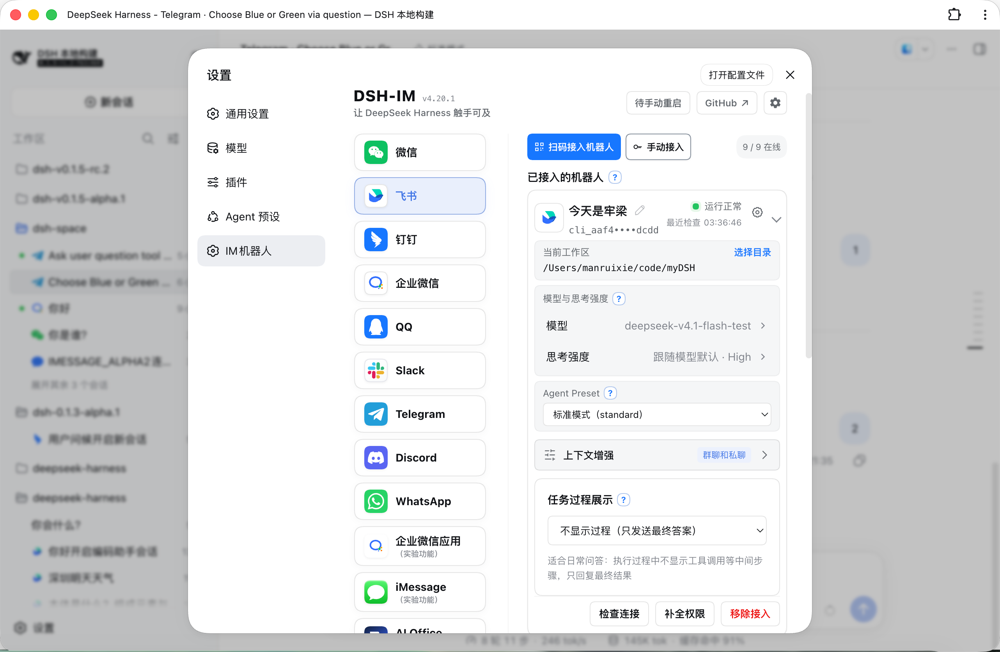

<h1> dsh-im</h1>

---

<div align="center">
  <p><strong>Connect IM bots to DeepSeek Harness with ease</strong></p>

  <p>
    <a href="LICENSE"></a>
    
    
  </p>

  <p><a href="README.md">简体中文</a> · <strong>English</strong></p>
</div>

---

## Introduction

Connect IM bots to DeepSeek Harness by scanning a QR code, using an App Manifest, or entering existing bot credentials. One plugin and one settings entry provide unified management for Feishu, WeChat, DingTalk, WeCom, QQ, Slack, Telegram, Discord, and WhatsApp bots.

> GitHub description: Connect IM bots to DeepSeek Harness by QR code, App Manifest, or bot credentials (supports Feishu, WeChat, DingTalk, WeCom, QQ, Slack, Telegram, Discord, and WhatsApp).

## Interface



## Built-in channels

- Feishu: create a bot by QR code or bind an existing bot with App ID + App Secret, then send and receive messages over a persistent connection.
- WeChat: bind a WeChat bot by scanning a QR code, then send and receive messages through Tencent iLink long polling.
- DingTalk: create a bot by QR code or bind an existing bot with Client ID + Client Secret, receive messages through DingTalk Stream, and stream Harness replies through AI Cards.
- WeCom: create an intelligent bot by QR code or bind an existing bot with Bot ID + Secret, receive messages over the official WebSocket connection, and natively show a thinking state, tool progress, and streaming replies.
- QQ: create a bot by QR code or bind an existing bot with AppID + AppSecret, receive messages over a WebSocket connection, stream private-chat replies with a native typing indicator, and reply in groups when mentioned.
- Slack: use the bundled App Manifest to create and configure an app, enter its Bot Token (`xoxb-`) and App Token (`xapp-`), receive events over Socket Mode, reply directly in DMs and only when mentioned in channels, and prefer Slack's native streaming-message API for Harness output.
- Telegram: bind a BotFather-created bot with its Bot Token, receive messages through Bot API long polling, reply directly in private chats, require a mention or reply in groups, and stream Harness output by editing the reply.
- Discord: bind a Developer Portal bot with its Bot Token, receive events through Gateway v10, reply directly in DMs, require a mention in server channels, and stream Harness output by editing the reply.
- WhatsApp: scan a QR code to link a WhatsApp device, receive messages over WhatsApp Web, show a native read receipt and typing indicator, and then send the final Harness answer.

Other IM platforms can be added through the same channel-adapter structure.

## Installation

```sh
npx -y github:xmanrui/dsh-im install
```

Alternatively, install it directly from npm:

```sh
dsh plugin --profile web add @xmanrui/dsh-im
```

Restart `dsh web`, then open **Settings → Plugins → IM Bot**. The installer replaces directly installed `dsh-feishu`, `dsh-weixin`, and `dsh-dingtalk` entries in the profile with `dsh-im` without deleting channel data.

Feishu, QQ, DingTalk, and WeCom each provide two entry points. The blue **QR access** action uses the platform QR flow; the key-marked, outlined **Manual access** action immediately to its right connects an existing bot application. Feishu and QQ use App ID + App Secret and AppID + AppSecret respectively, DingTalk uses Client ID + Client Secret, and WeCom uses Bot ID + Secret. Secrets are sent only to the local Harness Host and stored through its protected credential provider; status responses and bot lists never return them.

Telegram and Discord do not provide an official QR flow for creating bots, so their pages expose only the key-marked **Manual access** action and request a Bot Token. Generate the Telegram token with BotFather; an existing webhook must be removed by its current service before Bot API long polling can receive updates. Generate the Discord token on the Developer Portal's Bot page, invite the bot to the target server, and grant View Channel, Send Messages, and Read Message History. The plugin reads DMs and server messages that explicitly mention the bot, so it does not request the privileged Message Content intent.

Slack provides Manifest-assisted creation with dual-Token access. Choose **Start setup**, copy the bundled App Manifest, open Slack's create page, and select **From a manifest**. Under **Basic Information → App-Level Tokens**, generate an App Token with `connections:write`; then install the app to the workspace under **OAuth & Permissions** to obtain the Bot Token. The plugin validates both Tokens before opening Socket Mode. Slack has no official QR-based bot-creation flow. Both Tokens are sent only to the local Harness Host and stored through its protected credential provider; status responses and bot lists never return them.

WhatsApp exposes only **QR access**. On the phone, open **WhatsApp → Settings → Linked devices → Link a device**, then scan the QR code shown by Harness. No Meta console, Cloud API, Webhook, Phone Number ID, or Access Token is required. Linked-device state stays under `~/.dsh/integrations/dsh-whatsapp/auth`; the browser receives only the one-time QR code and redacted account status. Personal accounts can use WhatsApp's **Message yourself** chat directly; the plugin suppresses only its own exact reply message IDs to prevent reply loops.

Use a dedicated WhatsApp number for the bot when possible. Linking a personal account makes DMs sent to that account eligible Harness input; group messages trigger only when they mention or reply to the linked account. Limit the number to trusted contacts, and remove the device from both Harness and the phone's **Linked devices** list when it is no longer used.

For DingTalk QR binding, scan with an account that belongs to an enterprise or organization and can create bots, then choose **Create a new bot** on the authorization page. If DingTalk reports that the account has not joined an organization, create one or switch to an account that has, then scan again. There is no second local sender-approval flow: the bot's DingTalk visibility is its inbound access scope, so restrict it to trusted organizations, groups, or members.

For WeCom QR binding, scan with an account that belongs to an enterprise and can create or manage bots, then confirm creation of the intelligent bot in the mobile app. This creates a WeCom intelligent bot; it does not sign the plugin into a personal WeChat account. For both QR and credential binding, restrict the bot's WeCom visibility to trusted enterprise members and group chats.

QQ QR binding uses Tencent's official QQBot v2 flow. Tencent's default authorization page labels the integration as a third-party bot. Scanning creates a QQ Open Platform bot; it does not give the plugin direct control of a personal QQ account. QR binding accepts only the scanner's messages. Manual credentials cannot identify a scanner, so the bot's QQ Open Platform visibility becomes its inbound access scope.

Feishu QR binding records the scanner as an allowed user. Manual credentials cannot identify a scanner, so the Feishu application's visibility becomes its inbound access scope. Restrict the application to trusted tenants, groups, or members.

Each bot maintains an independent Harness workspace. A newly connected bot records the Harness Host process's current working directory (`process.cwd()`) as its default; the path is persisted and does not change when the Host is later restarted from another directory. Every bot card shows the current path and lets it be edited.

## Bot commands

| Command | Description |
| --- | --- |
| `/workspace <absolute workspace path>` | Switch the current bot's Harness workspace. |
| `/workspacelist` | List workspace absolute paths that still exist on the current Harness Host. |
| `/sessionlist [workspace number or absolute path]` | List every registered session ID and title in the selected workspace; omit the argument to use the current workspace. |
| `/session <Session ID>` | Bind the current chat to an existing Harness session. |

Examples: `/workspace /Users/alice/projects/my-app`, `/sessionlist 2`, `/sessionlist /Users/alice/projects/my-app`, or `/session session-id`

- The path must be an existing absolute directory. The bot returns an actionable error and the correct usage when validation fails.
- `/workspacelist` takes no arguments. It combines the Harness global registry with the current bot's path. When that current path still exists and is safe to display, it appears first and is marked as current. Any listed path can be copied directly into `/workspace`.
- A numeric `/sessionlist` argument uses the same freshly resolved order as `/workspacelist` at command execution time. An absolute path can also select a workspace directly, and the result echoes the resolved path.
- `/sessionlist` includes every session registered to the selected workspace. Archived sessions are marked as archived; blank and subagent sessions are included when they belong to that workspace; sessions without a title are shown as `No title yet`. Any listed ID can be passed directly to `/session Session ID`.
- `/session` accepts exactly one Session ID obtained from `/sessionlist`. It neither creates a session nor immediately prompts the model; later messages in the current chat continue the bound session. Regular archived sessions can be bound without being unarchived, while subagent sessions cannot be bound.
- `/session` locates the session's unique workspace automatically. Binding inside the current workspace replaces only this chat's mapping. A cross-workspace binding switches the bot workspace, clears the old session mappings for all of that bot's chats, and then binds this chat, so it affects the bot's other chats. A reply already being generated may still finish.
- Workspace switches and session bindings only clear or replace dsh-im chat mappings. They never delete, empty, or archive old Session contents; an old Session can still be listed and bound again.
- Any user who is already within the platform bot's visibility scope and can normally message it can run these commands; there is no additional administrator/ordinary-user distinction.
- The list comes from the Harness Host's global registry and can include local absolute paths for other bots, other channels, or non-IM projects. Restrict the bot's visibility to trusted users.
- Session results also come from the global Harness Host. Session IDs and titles can belong to other bots, other channels, or non-IM projects, and may contain sensitive metadata. Enable these commands only when every user in the bot's visibility scope is trusted.
- Any user who can run `/session` can continue the selected session and use later messages to write to it or invoke its available tools. Expose the bot and session list only to trusted users.
- A successful switch clears only the current bot's old Harness session mappings and does not affect other bots.
- The new workspace applies to subsequent messages; a reply that has already started generating is allowed to finish.

## Design

- Registers a single **IM Bot** settings page in Harness.
- Maintains all nine channel Host, client, and runtime sources in this repository without external standalone channel plugins.
- Follows the DeepSeek Harness language preference and switches the settings UI live between Chinese and English.
- Uses channel logos for WeChat, Feishu, DingTalk, WeCom, QQ, Slack, Telegram, Discord, and WhatsApp navigation without enable/disable switches.
- Keeps RPC endpoints, credentials, connection supervision, and session mappings isolated by channel.
- Returns only QR codes, the public Slack Manifest, and redacted status data to the browser. Manually entered secrets and Tokens travel one way to the local Host; no RPC response returns App Secrets, `bot_token`, DingTalk `client_secret`, WeCom Secrets, QQ `app_secret`, Slack Bot/App Tokens, Telegram/Discord Bot Tokens, WhatsApp linked-device keys, or raw user identifiers.

## Local development

```sh
npm install
npm run check
node bin/dsh-im.mjs install --source .
```

`npm run check` runs unit tests, builds the Host and Client artifacts, and verifies that the published package contains neither credentials nor standalone channel settings-page registrations.

IM management RPCs accept loopback browsers by default. When a Web profile is deliberately served on a trusted LAN, opt the plugin into the Host authorities already trusted by Connection in that profile's `cordis.patch.yml`:

```yaml
- id: xmanrui-dsh-im
  config:
    rpcAuthority: trusted-host
```

`trusted-host` reuses Harness's Host/Origin fence; it is not user authentication. Anyone who can reach that LAN authority can inspect bot status, scan or submit application credentials, reconnect bots, and remove bots. Enable it only on a trusted network.

---

## Contact

You can reach me by email, WeChat, or Xiaohongshu.

<table>
  <tr>
    <th align="center">Email</th>
    <th align="center">WeChat</th>
    <th align="center">Xiaohongshu</th>
  </tr>
  <tr>
    <td align="center" valign="middle">
      <a href="mailto:longmanr307@gmail.com">longmanr307@gmail.com</a>
    </td>
    <td align="center" valign="top">
      <a href="docs/images/weixin.jpg"></a>
    </td>
    <td align="center" valign="top">
      <a href="docs/images/xhs.jpg"></a>
    </td>
  </tr>
</table>
