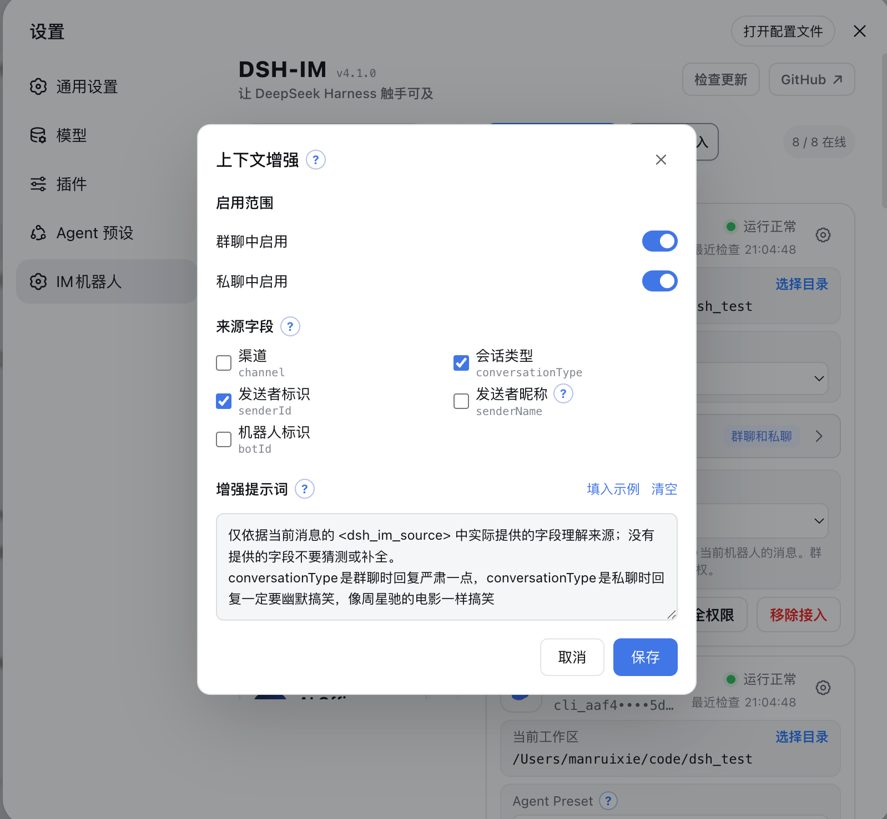
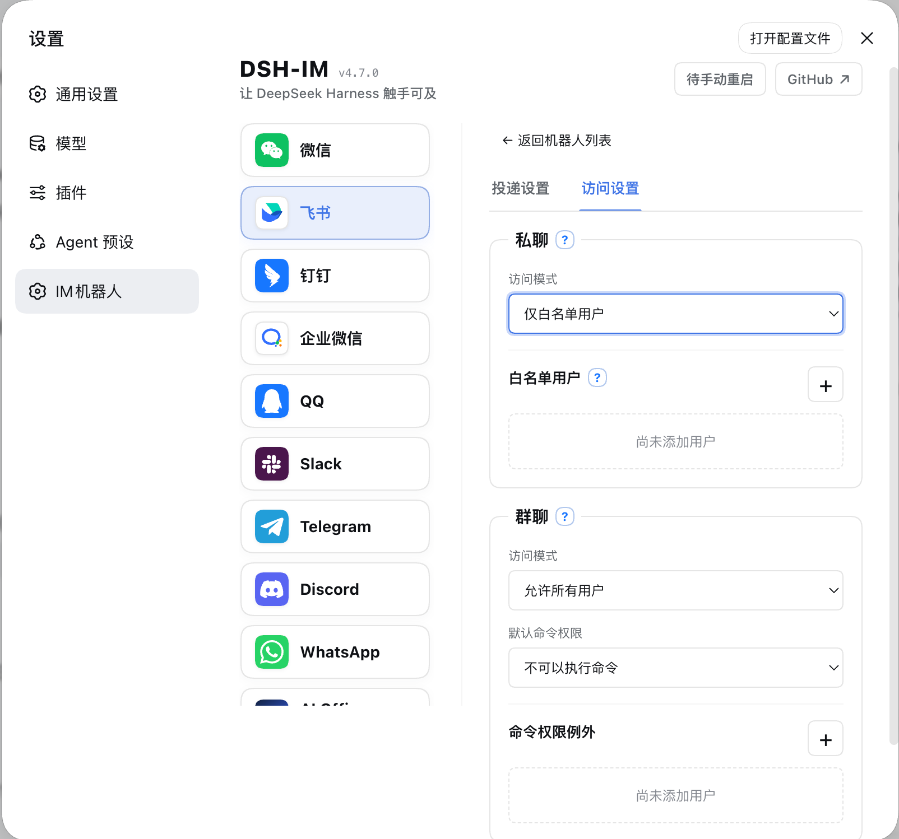
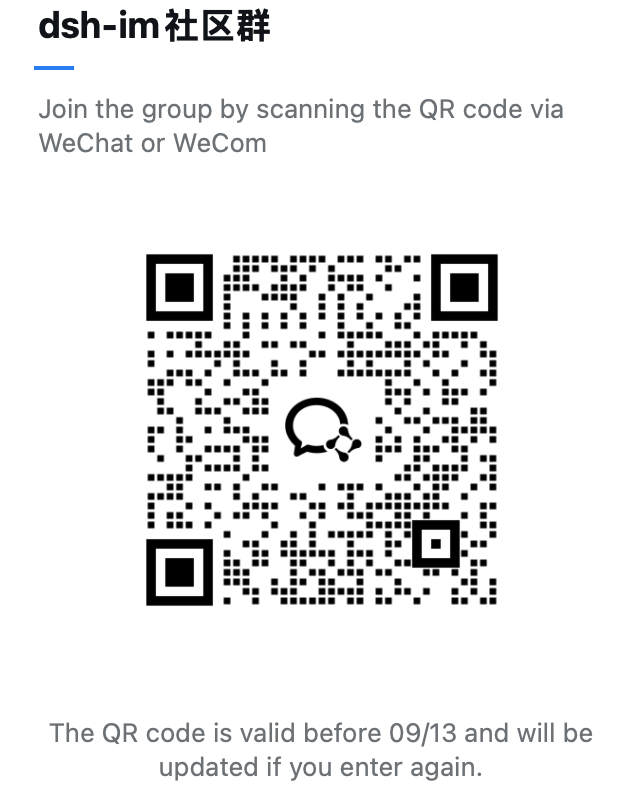

<p align="center">
  &nbsp;&nbsp;
  
</p>

---

<div align="center">
  <p><strong>让 DeepSeek Harness 触手可及</strong></p>
  <p><strong>Connecting DeepSeek Harness</strong></p>

  <p>
    
    <a href="LICENSE"></a>
    
    <a href="https://dshfind.com/zh/plugins/xmanrui/dsh-im?ref=badge"></a>
    <a href="https://dshfind.com/zh/plugins/xmanrui/dsh-im"></a>
    <a href="https://dshfind.com/zh/plugins/xmanrui/dsh-im?ref=badge"></a>
  </p>

  <p>
    
    
    
    
    
    
    
    
    
  </p>

  <p><strong>简体中文</strong> · <a href="README.en.md">English</a></p>
</div>

---

## 简介

通过扫码、App Manifest 或已有机器人凭据把 IM 机器人接入 DeepSeek Harness，并让本机 Harness 主动连接公网 AI Office。一个插件、一个设置入口，统一管理九种 IM 渠道和 AI Office Connector。**每个 IM 渠道都支持接入多个机器人**，各机器人的连接状态、工作区、模型和会话绑定彼此独立。

Connect IM bots to DeepSeek Harness by scanning a QR code, using an App Manifest, or entering existing bot credentials, and let the local Harness connect outward to a public AI Office. One plugin and one settings entry manage nine multi-bot IM channels and the AI Office Connector.

## 本 Fork 的改动（拟人化）

本仓库是从 `xmanrui/dsh-im` fork 出来的"拟人化"分支，在保留上游全部功能的基础上，新增面向角色扮演沉浸体验的设置。全局项在「设置 → IM机器人 → 通用设置」的**拟人化设置**面板中配置；**全部拟人化设置**还支持在每个渠道的机器人卡片里按机器人逐项覆盖。

### 速览：与上游的全部差异

| 改动 | 默认 | 说明 |
| --- | --- | --- |
| 流式回复 `streaming` | 开 | 关闭后一次性发送完整回复，不逐字推送 |
| 分步消息 `message_break` | 关 | 注册 no-op 工具，模型主动调用拆长回复为多条消息 |
| 新消息行为 `onNewMessage` | interrupt | interrupt / queue / steer 三档；上游仅 queue |
| 状态表情回应 `statusReaction` | 开 | 关闭后六渠道停发处理中/成功/失败表情 |
| 回复引用 `replyQuote` | 开 | 关闭后 Telegram/Discord/WhatsApp 回复不带引用头 |
| 过程进度提示 `progressStatus` | 开 | 关闭后不发"正在处理…/正在使用工具…/正在整理结果…"占位与中间进度气泡，回复直达；流式文本仍逐字显示 |
| 发送延迟 `sendDelay` | 关 | 阅读延迟 + 分段间隔两阶段，含活跃响应 |
| 输入状态指示 `typingIndicator` | burst | off / continuous / burst 三档 |
| QQ 桥接 messageBreak 修复 | — | 修复上游 `messageBreakHandler` 作用域缺陷 |
| QQ 输入状态会话重写 | — | 桥内自管理 55s/50s 替代失效的 SDK 中间件 |
| 延迟窗口双回复修复 | — | 被取代回合静默取消，无双回复 |
| `send_im` 投递工具 `imSendTool` | 开 | 注册模型工具，在默认静默（无 IM 可见性）的回合主动投递文字；`botId`/`targetId` 可省略，自动投到当前 Session 绑定的私聊（未绑定则报错） |

> 上游同步说明：本分支为长期维护的 fork，会持续合并 `xmanrui/dsh-im` 上游更新；上游修复与功能在合并时保持完全兼容。**分步消息（message_break）、流式开关（streaming）、发送延迟与输入状态指示依赖本 fork 对 Harness 回复追踪（HarnessReplyTracker）与渠道桥接的扩展**，在上游仓库中不可用。

- **流式回复（streaming，默认开启）**：关闭后不再逐字推送模型输出，而是等回合结束后一次性发送完整回复，更接近真人回复节奏。可与 message_break 同时开启。
- **分步消息（message_break，默认关闭）**：插件会注册一个名为 `message_break` 的 **no-op 工具**（不执行任何操作，仅作为回复中的断点标记）。模型在长回复中主动调用它来"换气"时，插件会把断点之前的文本作为一条独立消息发送，随后继续发送后续分段，整段回答因此变成多条消息，读起来更像真人逐条输入。三个分隔点（思考/工具进度与最终回答之间、长回答的段落之间、前后文切换处）最自然；单回合最多拆分 20 段，纯空白分段会被跳过。
- **新消息行为（onNewMessage，默认 interrupt）**：模型生成过程中用户又发来新消息时的处理方式：
  - **打断重发（interrupt）**：取消当前回合并立即用新消息重新提问；
  - **排队等待（queue）**：等当前回合结束后再处理新消息（上游默认行为）；
  - **注入纠偏（steer）**：不中断生成，把新消息文本注入为当前回合的纠偏指令，模型在回答末尾顺势回应。

  当回合正在等待用户交互（提问/审批等待、验证码等）时，一律按排队处理，保证交互流程不被新消息打乱。

- **状态表情回应（statusReaction，默认开启）**：机器人在用户消息上用表情标记任务状态（处理中/成功/失败，例如 Telegram 的 👀 → 👍/👎）。关闭后不再发送任何表情，回复照常送达。支持 Telegram、Discord、WhatsApp、Slack、飞书、钉钉。
- **回复引用（replyQuote，默认开启）**：机器人回复时引用你的消息（回复顶部的引用样式）。关闭后回复以普通消息发出。仅影响 Telegram、Discord、WhatsApp 的引用样式；话题路由（Telegram 话题、Discord Thread、Slack 线程、飞书话题回复）与会话归组不受影响。
- **过程进度提示（progressStatus，默认开启）**：处理任务时显示中间状态气泡（如"正在处理…""正在使用工具…""正在整理结果…"）。关闭后不再发送占位气泡与中间进度文案，回复直达；流式文本仍正常逐字显示。**与 message_break 同时开启时**，关闭此项会连带跳过占位流（分段直接逐条发送，消除占位气泡与分段消息的内容重复）。支持所有聊天渠道；QQ/微信本就无中间进度，AI Office 任务进度不受影响（属产品核心 UX）。

### 发送延迟（两阶段模型）

发送延迟把"真人感"拆成两个阶段，对应真人在 IM 里的两个真实间隙：

1. **阅读延迟（readDelay，阶段①）**：机器人收到消息后**先静默一段时间**才开始处理，模拟"过了一段时间才读到消息"。静默期没有任何输入状态或已读提示。时长为 `minMs–maxMs` 区间随机值，另有两个可选加项：
   - **按消息长度阅读项（charsPerSecond）**：用户消息越长，"读"得越久（按字符数除以阅读速度累加）；
   - **活跃响应（activityBoost）**：刚聊完天时"秒回"，闲置越久延迟越接近完整区间——上一回合结束后 0–`fastWindowMs`（默认 1 分钟）内直接用 `fastReplyMs`（默认约 1 秒）；`minWindowMs`（默认 2 分钟）前线性回升到阅读延迟下限；超过 `fullWindowMs`（默认 5 分钟）回到完整随机区间。首条消息不加速。

   总延迟受 `maxTotalMs` 封顶；**无输入状态接口的渠道（钉钉、企业微信、飞书、Slack 等）阅读延迟封顶 5 秒**。钉钉的分段间隔额外强制 ≥3 秒（webhook 频控）。
2. **分段间隔（segmentGap，阶段②的一部分）**：分步消息或流式分段的两条消息之间"正在打下一条"的停顿，同样为 `minMs–maxMs` 随机，可按分段长度加项。

**取代（supersede）语义**：阅读延迟期间用户又发来新消息（interrupt 模式）或执行 `/stop` 时，旧回合**静默取消**——不生成、不发送、无"处理失败"提示、无双回复，新消息立即接管。排队（queue）模式下多条消息依次处理，延迟会累积（每条都"被读一遍"）。

发送延迟默认关闭（`enabled=false`），此时除上述取代修复外行为与上游完全一致。设置面板提供**全参数面**：阅读延迟 min/max、阅读速度（字/秒）、单回合封顶、活跃响应（快速回复 + 秒回/恢复下限/完全恢复三个时间窗）、分段间隔与分段打字速度，折叠区内的断续节奏高级参数（亮/灭四档毫秒），以及**探索预设**（轻拟人 / 慢性子 / 沉浸角色扮演 / 即刻应答，一键填充全部字段）。配置文件（`~/.dsh/integrations/dsh-im/humanize.json`）支持同样的全部参数。**每个机器人可在其渠道卡片的「拟人化」折叠面板中逐项覆盖全部设置**（流式回复、分步消息、状态表情回应、回复引用、新消息行为、输入状态指示、断续节奏、发送延迟）：每项可选择「跟随全局」或自定义值，保存只写被自定义的项，未自定义的项继续跟随全局默认变化。

### 输入状态指示（typingIndicator）

进入处理阶段后"正在输入"的显示方式，三档：

- **关闭（off）**：完全不显示输入状态；
- **持续（continuous）**：处理期间持续显示；
- **断续（burst，默认）**：像真人一样时断时续——显示几秒、熄灭一两秒、再显示，避免长时间挂机的机器人感。断续节奏（typingBurst 的 on/off 区间）可在配置文件中调整。

渠道能力差异：Telegram / Discord / WhatsApp（composing）支持全部三档；微信在阅读延迟结束后拉取输入票据并保活；QQ 仅私聊支持（群聊无此 API），且改用桥内自管理的输入状态会话（55 秒显示 / 50 秒续期）替代上游依赖的、已失效的 SDK 中间件；钉钉、企业微信、飞书、Slack 无输入状态接口，自动忽略此项。交互等待（提问/审批）期间输入状态暂停显示，回合结束（含 `/stop`、出错）后必定熄灭。

### 修复的缺陷（上游 bug）

以下问题在上游 `xmanrui/dsh-im` v4.13.0 中存在，本 fork 已修复：

- **QQ 桥接 `messageBreakHandler` 作用域缺陷**：上游中任何成功回合只要启用 message_break 就会触发 `ReferenceError` 并误报"任务未完成"（也是 4 个基线测试失败的根因）。本 fork 修复了作用域，message_break 在 QQ 渠道正常工作。
  Fixes a QQ bridge `messageBreakHandler` scoping bug in upstream: any successful turn with message_break enabled threw a `ReferenceError` and misreported a task failure (also the root cause behind 4 baseline test failures).
- **延迟窗口内被取代回合的双回复**：阅读延迟计时期间用户又发来新消息（interrupt）或执行 `/stop` 时，旧回合会被**静默取消**——不生成、不发送、无"处理失败"提示、无双回复，新消息立即接管。被取代的批量输入保留待 `/send` 重试。上游的 queue 模式无此问题；本修复覆盖 interrupt 模式。
  Fixes double replies for turns superseded during the delay window: a new message (interrupt) or `/stop` while the read delay is ticking silently cancels the old turn — no generation, no send, no failure notice, no double reply; superseded batch inputs are retained for `/send` retry. Upstream's queue mode was unaffected; this fix covers interrupt mode.

### 配置迁移

- **`readDelay.idleBoost` → `readDelay.activityBoost`（语义反转）**：早期版本的"闲置加成"（闲置越久延迟 ×N）已被语义反转并替换为"活跃响应"（刚聊完天"秒回"）。已存的 `idleBoost` 键在读取时被忽略并回落新默认值——如果你之前调过闲置加成，请在设置面板重配活跃响应。
  **`readDelay.idleBoost` → `readDelay.activityBoost` (semantic inversion)**: the early "idle boost" (the longer the idle, the slower the reply) is semantically inverted and replaced by "activity boost" (fast replies right after a quick exchange). A stored `idleBoost` key is ignored on load and falls back to the new defaults; if you had tuned the idle boost, re-configure the activity boost in the settings panel.

## 界面


 

## 当前内置渠道

| 渠道 | 接入方式 | 消息与回复 |
| --- | --- | --- |
| 飞书 | 扫码创建机器人，或使用 App ID + App Secret 手动绑定 | 长连接接收消息；通过飞书流式卡片显示思考、工具进度和回答 |
| 微信 | 使用微信扫码绑定机器人 | 腾讯 iLink 长轮询收发消息；等待 Harness 回答时显示“正在输入”，最终回复按 1,800 字符分段发送 |
| 钉钉 | 扫码创建机器人，或使用 Client ID + Client Secret 手动绑定 | 钉钉 Stream 长连接；通过 AI Card 流式显示回答 |
| 企业微信 | 使用企业微信 App 扫码创建智能机器人，或使用 Bot ID + Secret 手动绑定 | 官方 WebSocket 长连接；原生显示“正在思考中”、工具执行进度和流式回答 |
| QQ | 使用手机 QQ 扫码创建机器人，或使用 AppID + AppSecret 手动绑定 | WebSocket 长连接；私聊显示“正在输入”并以单条 Markdown 回复，群聊被 @ 后只发送最终答案 |
| Slack | 使用预置 App Manifest 创建应用，再填写 Bot Token（`xoxb-`）和 App Token（`xapp-`） | Socket Mode 长连接；私聊直接回复，频道被 @ 后响应，优先使用官方流式消息 API |
| Telegram | 使用 @BotFather 生成的 Bot Token | Bot API 长轮询；默认私聊直接响应、群聊被提及或回复时响应，也可为每个机器人独立启用私聊白名单安全模式；私聊通过 Rich Message Draft 流式预览并持久化最终富消息，群聊和 Topic 原位完成占位消息，平台不支持时回退为普通文字 |
| Discord | 使用 Developer Portal 生成的 Bot Token | Gateway v10 长连接；私信直接回复；服务器文字/公告频道首次 @ 后创建原生 Thread，后续在线程中无需重复 @，并通过编辑消息流式显示回答 |
| WhatsApp | 使用手机 WhatsApp 扫码关联设备 | WhatsApp Web 长连接；默认仅响应账号自聊，也可切换到指定联系人或开放响应模式；显示已读和“正在输入”，通过每秒编辑同一条消息显示工具进度和逐步生成的回答，长回复自动分段，编辑失败时回退为完整文字回复 |

其他 IM 平台可继续按同一渠道适配器结构接入。

九个内置渠道均支持把 JPEG、PNG、WebP 图片，以及以图片文件方式发送的 GIF，连同可选文字说明发送给 Harness；单张图片上限为 5 MB，单条消息中的图片总大小上限为 20 MB。飞书下载用户消息中的图片或文件需要租户权限 `im:message:readonly`，确认页将其显示为“获取单聊、群组消息”；飞书目前没有为该下载接口提供仅限图片的更窄权限。扫码新建的应用会默认申请；已有或手动绑定的应用可私聊机器人执行 `/repair`，或在「IM机器人」设置页点击“补全权限”，扫码增量补全该权限、上传机器人图片或文件所需的 `im:resource`、原生命令面板所需的 `application:app_slash_command:read` / `write`，以及卡片回调。

### 超时后的结果补发

九个渠道共用超时任务跟踪：收到“等待模型回复超时”后，插件会继续检查原任务，完成后向原聊天或线程补发最终文字；插件重启或连接恢复后也会继续检查。`/stop` 只停止当前聊天提交的对应回合，切换会话后不再向该聊天补发旧会话的结果。无需新增设置，正常回复流程保持原样。

补发仍受渠道发送权限和配额限制。明确发送失败最多尝试三次；发送结果不确定时保留记录并停止自动重试，避免重复消息。此机制恢复文字结果和终态通知，不重放问题、审批或文件工具调用。详见[延迟交付说明](docs/deferred-delivery.md)。

### 结果文件与图片回传

九个内置渠道均已实现把 Harness 可读取的文件作为渠道原生附件回传。已有文件和当前任务新生成的文件都可以直接发送；该能力对所有已连接机器人默认可用，无需开关或机器人白名单，原有文字、图片、流式回复、命令和会话行为保持不变。

模型调用文件回传工具后，插件把指定文件交给当前渠道的原生接口。图片会优先以原生图片消息呈现；渠道不支持或明确拒绝图片发送时自动回退为文件附件，发送结果不确定时不会补发文件造成重复消息。插件不额外设置文件来源、创建时间、工作区边界、扩展名、内容、数量、大小或有效期规则；文件只需真实存在且可读取。渠道平台仍可能依据自身权限、配额、文件能力或账号等级拒绝发送，插件会按平台返回结果提示。

GIF 动图按各渠道原生能力呈现，存在差异：Telegram 把 `.gif` 走原生动画消息（`sendAnimation`），客户端内联循环播放；微信（iLink）协议只提供图片消息、没有独立的表情/动图消息类型，GIF 经图片消息只显示静态首帧，无法内联动图（这是协议层限制，非插件可修）；其余渠道以各自图片消息对 GIF 的原生表现为准。文件名需带 `.gif` 扩展名才会走图片/动画路径，无扩展名的 GIF 会被当作普通文件发送。

| 渠道 | 平台要求 |
| --- | --- |
| 微信 | 当前绑定协议和会话需支持原生文件消息，实际可发送范围以微信接口返回为准。 |
| 飞书 | 飞书文件上传接口要求文件非空且不超过平台 30 MB；应用需有租户权限 `im:resource`（“读取与上传图片或文件资源”）。内置扫码流程新建应用时默认申请该权限；已有或手动绑定的应用可通过“补全权限”或私聊 `/repair` 增量补全并完成飞书要求的审批。飞书开发者后台当前没有单独的 `im:resource:upload` 权限。 |
| 钉钉 | 应用需开通 `qyapi_base`，机器人需具备文件消息能力；实际格式和大小以当前 OAPI 与机器人能力返回为准。 |
| 企业微信 | 应用需具备素材上传和文件消息能力，实际可发送范围以企业微信接口返回为准。 |
| QQ | 机器人需具备文件消息能力，并受 QQ 当日文件上传配额约束；额度耗尽时会明确提示稍后重试。 |
| Slack | Bot Token 需有 `files:read`、`files:write` 和 `reactions:write`；实际文件大小上限由 Workspace 当前策略决定。已有 App 新增或变更 Scope 后，必须重新授权/安装 App 并重新连接机器人。 |
| Telegram | 机器人必须能在当前聊天发送文档，实际可发送范围以 Bot API 返回为准。 |
| Discord | Developer Portal 的 Bot 设置中需启用 **Message Content Intent**；机器人需有 **Send Messages**、**Create Public Threads**、**Send Messages in Threads** 和 **Read Message History** 权限；发送结果文件还需 **Attach Files**。实际附件额度由当前账号与服务器能力决定。 |
| WhatsApp | 当前绑定会话需支持 Document Message，实际可发送范围以 WhatsApp/Baileys 返回为准。 |

## AI Office Connector

[查看 AI Office Connector 说明](docs/AI-Office-Connector.md)

## 安装

推荐从 npm 安装已发布的稳定版本：

```sh
dsh plugin --profile web add -w @xmanrui/dsh-im
```

重启 `dsh web`、刷新浏览器，然后打开「设置 → IM机器人」。IM机器人使用 `order: 21`，尽量排在一级设置菜单的「Agent 预设」之后；插件页面不再保留旧入口。从旧版升级不会改变已有机器人、凭据、工作区、Agent Preset 或会话绑定。

本机 `dsh web` 和 DSH Desktop 默认直接复用当前 Host 的内部服务：旧版 Harness 使用 `apiProxy`，新版 Harness 自动使用 Typert Gateway、Session Controller 和 Workspace Controller，不需要配置 Harness 地址，也不绕行本机 HTTP 端口。Desktop 的兼容模式、扩展窗口和增强模式均无需开启“允许在浏览器中打开”或局域网访问。渠道配置中显式设置的 `harnessBaseUrl` 仅保留给旧版远程 HTTP/WebSocket Harness；内部调用失败不会自动改连其他 Host。

如需试用尚未发布到 npm 的最新代码，可以改用 GitHub 源安装器：

```sh
npx -y github:xmanrui/dsh-im install
```

GitHub 源安装会直接拉取并构建 Git 依赖；pnpm 10 及以上版本可能要求先在 profile 的 `pnpm-workspace.yaml` 中允许该依赖执行构建脚本。普通用户建议优先使用 npm 稳定版。

安装后，在对应渠道页面按照内置引导完成扫码或凭据配置。所有 Secret 和 Token 只提交给本机 Harness Host，并写入受保护的凭据存储；状态接口和机器人列表不会回传这些凭据。

如果本机必须通过正向代理访问飞书，请在启动 `dsh web` 前把 `HTTPS_PROXY` 设置为包含协议的 HTTP 代理 URL（例如 `http://proxy:8080`；也支持小写 `https_proxy`，并兼容使用 `HTTP_PROXY` 作为回退），修改后重启 Host。飞书注册和凭据验证会复用 SDK 的代理感知 HTTP 客户端，消息长连接会显式通过这个代理建立 WebSocket；长连接目前不读取 `ALL_PROXY` 或 `NO_PROXY`。

如果本机无法直连 Telegram Bot API，请使用 Node.js 22.21 或更高版本，并在启动 `dsh web` 前启用 Node 的环境变量代理支持：

```sh
NODE_USE_ENV_PROXY=1 \
HTTPS_PROXY=http://proxy:8080 \
HTTP_PROXY=http://proxy:8080 \
NO_PROXY=localhost,127.0.0.1 \
dsh web
```

代理地址按本机网络环境填写；修改代理后需要重启 Host。绑定 Telegram Bot Token 时，如果页面提示无法访问 Bot API，请优先检查代理地址、Node.js 版本和 `NO_PROXY` 配置。

| 默认行为 | 说明 |
| --- | --- |
| 机器人工作区 | 每个机器人独立保存工作区。新机器人默认使用 Host 当时的工作目录；之后可在机器人卡片中修改。 |
| 模型 | 九个 IM 渠道的每个机器人都可在工作区下方独立选择模型；未选择时跟随 Host 默认。切换只影响之后新建的会话；当前聊天先发送 `/new`，再发送普通消息才会使用新选择。 |
| Agent Preset | 每个机器人可在设置页卡片中选择 Agent Preset。未选择时跟随 Host 的 `agent-presets.default`；渠道级 `config.agentPreset` 只作为该渠道之后新接入机器人的默认值。切换不会修改或清空已有会话；若当前聊天已有会话，需先发送 `/new`，再发送一条普通消息，才会按新选择创建会话。 |
| 上下文增强 | 从机器人卡片打开设置，分别决定群聊、私聊是否增强；两个开关默认均关闭，旧机器人升级后也不会自动开启。 |

### 主动投递

九个 IM 渠道都可以使用稳定的 `botId + targetId` 主动发送文字消息。机器人设置页支持从已聊会话选择或手工填写目标、保存前测试当前路由，以及复制调用参数；HTTP POST、同 Host 插件和 Connection RPC 共用同一目标配置与投递核心。

已保存的私聊目标还可以开启默认关闭的「会话双向同步」。开启后，DSH Web／CLI 在该私聊当前 Session 中发送的用户文字和最终助手文字会同步回私聊；IM 侧原有提问与 `/steer` 不会重复。开关自动跟随 `/session`、`/new` 和工作区切换后的当前 Session。首版仅支持当前 Host 的私聊文字；群聊、Topic、Thread 与显式远程 `harnessBaseUrl` 不支持。

设置步骤、九渠道字段、完整调用示例、管理端点、错误码与排错说明请查看[《主动投递使用指南》](PROACTIVE_DELIVERY.md)（[English](PROACTIVE_DELIVERY.en.md)）。

### 上下文增强

[查看上下文增强说明](docs/上下文增强.md)

### 访问模式

[查看访问模式说明](docs/访问模式.md)

## 检查与安装更新

[查看检查与安装更新说明](docs/检查与安装更新.md)

## 机器人命令

| 命令 | 作用 |
| --- | --- |
| `/help` | 显示机器人支持的命令和用法。 |
| `/menu`、`/m` | 飞书、钉钉和企业微信打开交互菜单。钉钉的会话、工作区、预设和模型按两列排列，选择后立即生效，并在原卡片更新结果。企微下拉选择后点击应用；收到每日进入单聊事件时也会自动展示菜单。菜单还提供新会话、停止、压缩、状态与帮助等按钮。 |
| QQ `/menu`、`/m` | 打开按钮与数字菜单：会话选择、工作区、模式／预设、模型、新会话、会话列表、停止、压缩、补充指令、归档显示切换、状态和帮助。列表支持分页；按钮不可用时回复数字选择。菜单按聊天和操作者隔离，15 分钟或重启后失效；普通消息退出数字选择，审批、提问和批量输入保留原有优先级。 |
| `/new` | 解除当前聊天的会话绑定，让下一条普通消息开启全新 Harness 会话。 |
| `/status` | 检查当前机器人与 DeepSeek Harness 的连接状态。 |
| `/version` | 查看当前运行的 dsh-im 插件版本。 |
| `/models` | 按序号列出当前配置的全部可用模型。 |
| `/model` | 查看当前聊天绑定会话正在使用的模型和推理等级。 |
| `/model <序号或 Provider/模型ID> [推理等级ID]` | 切换当前会话模型，并可同时指定目标模型支持的推理等级。 |
| `/reasoninglist`、`/reasonings` | 等价命令；列出当前模型支持的推理等级。 |
| `/reasoning` | 查看当前会话的模型和推理等级。 |
| `/reasoning <序号或等级ID>` | 切换当前模型的推理等级。 |
| `/reasoning --default` | 恢复当前模型的默认推理等级。 |
| `/presetlist`、`/presets` | 两个等价命令；按序号列出 Host 当前可用的 Agent Preset，并标记 Host 默认项和当前机器人的选择。 |
| `/preset` | 查看当前机器人的新会话 Agent Preset 设置。 |
| `/preset <序号或 Preset ID>` | 设置当前机器人的 Agent Preset；纯数字 ID 使用 `/preset id:<ID>`。 |
| `/preset --default` | 清除当前机器人的显式选择，让后续新 Session 跟随 Host 默认。 |
| `/stop` | 立即停止当前聊天正在运行的任务，并保留尚未开始的排队消息。 |
| `/steer <补充指令>` | 把补充指令立即加入当前聊天正在运行的任务。 |
| `/batch` | 在私聊中开启批量输入，最多收集 10 条纯文字消息。 |
| `/send` | 将已收集的消息按原顺序作为一次输入提交。 |
| `/cancel` | 取消批量输入并丢弃已收集的消息。 |
| `/repair` | 在飞书私聊中增量修复卡片回调，并补全媒体与原生 Slash Command 面板所需的权限。 |
| `/compact` | 立即压缩当前聊天绑定会话的较早上下文。 |
| `/workspace <工作区序号或绝对路径>`、`/ws <工作区序号或绝对路径>` | 按 `/workspacelist` 序号或绝对路径切换当前机器人的 Harness 工作区。 |
| `/workspacelist`、`/workspaces`、`/wsl` | 列出当前 Harness Host 上仍然存在的工作区绝对路径。 |
| `/sessionlist [工作区序号或绝对路径]`、`/sessions [...]` | 两个等价命令；列出指定工作区登记的所有会话 ID 和标题，省略参数时使用当前工作区。 |
| `/sessionlist --limit N`、`/sessions --limit N` | 列出当前工作区现有顺序中的前 N 个会话；N 必须是正整数。 |
| `/session <Session ID>` | 将当前聊天绑定到指定的已有 Harness 会话。 |
| `/history [数量]` | 在私聊中查看当前绑定会话的最近历史消息，默认 3 条，最多 5 条。 |
| 交互式提问 | 回复选项序号、选项文字或自定义文字；多选时用逗号分隔。 |
| 远程审批 | 回复 `批准` / `拒绝` / `同意` / `不同意` / `yes` / `no`。 |

### 命令说明

钉钉菜单使用插件内置的共享卡片模板，无需逐个机器人创建或配置模板。卡片打开后可操作 30 分钟；超时或 Host 重启后重新发送 `/m`。模板源文件保存在 `assets/dingtalk-menu-template.json`，供维护者导入卡片平台更新。

[查看命令说明](docs/机器人命令.md)

## 其它功能

- **图片识别**：九个内置渠道都可以把 JPEG、PNG、WebP，以及以图片文件方式发送的 GIF 交给 Harness；图片可以附带文字说明。单张图片上限为 5 MB，单条消息中的图片总大小上限为 20 MB。
- **在机器人卡片切换工作区**：设置页中的每张机器人卡片都会显示当前 Harness 工作区。可以直接填写已有目录的绝对路径，也可以打开目录选择器。切换只清除该机器人的旧聊天映射，不会删除、清空或归档旧 Session；已经开始的回复可以继续完成，后续消息使用新工作区。
- **在机器人卡片选择模型**：九个 IM 渠道的每张机器人卡片都在工作区下方提供模型选择，可选 Host 当前可用模型或跟随默认。选择按机器人独立保存，只用于之后新建的 Session；已有 Session 和正在生成的回复不受影响。
- **在机器人卡片选择 Agent Preset**：设置页中的每张机器人卡片都可以选择 Host 已有的 Agent Preset，或跟随 Host 默认。切换只作用于该机器人，并且只影响之后新建的会话；已有会话和正在生成的回复不受影响。
- **检查连接并发送测试消息**：机器人在线时，点击卡片上的「检查连接」会检查平台连接，并向该机器人最近记录的私聊发送一条“DeepSeek Harness 连接测试成功”消息；WhatsApp 会发送到账号自聊。测试消息不会创建 Harness Session，也不会调用模型。机器人必须至少收到过一条私聊才能记住测试目标，否则页面会提示尚无可用的测试会话。
- **重试连接和移除接入**：机器人离线时，卡片上的操作会变为「重试连接」；不再使用时可以点击「移除接入」。这些操作都只作用于所选机器人，不影响其他机器人或渠道。
- **多机器人独立管理**：同一渠道可以接入多个机器人。每个机器人分别保存凭据、连接状态、工作区、模型、Agent Preset 和聊天会话映射，卡片上的工作区、模型、Preset、连接检查、重试和移除操作互不影响。
- **流式回复和进度提示**：插件会按各平台能力显示正在思考、工具执行和逐步生成的回答；不支持原生流式接口的平台会通过编辑消息、卡片更新或最终消息完成回复。

## 设计

- Harness 一级设置菜单中只注册一个「IM机器人」设置页，其中包含九个 IM 渠道和一个 AI Office Connector；
- 九个渠道及 Office Connector 的 Host、客户端与运行时源码都在本仓库维护，不依赖外部独立插件；
- 设置页跟随 DeepSeek Harness 的语言选择，在中文和 English 之间即时切换；机器人发出的聊天消息跟随 Host 的 `language` 配置（默认中文；设为 `en` 即为英文），中文始终为兜底，未收录的文案原样输出；
- 左侧使用 Logo 切换微信、飞书、钉钉、企业微信、QQ、Slack、Telegram、Discord、WhatsApp 和 AI Office，不使用启用/停用开关；
- 九个 IM 渠道保持独立的 RPC、凭据、连接监督和会话映射；Office Connector 另行维护设备凭据、Job 租约、审批等待与并发上限；
- 浏览器只获得二维码、Manifest、脱敏状态，以及用户为当前 Telegram 或 WhatsApp 机器人主动保存的访问模式和白名单标识；手动输入的 Secret 或 Token 仅单向提交给本机 Host，任何 RPC 响应都不会返回 App Secret、`bot_token`、钉钉 `client_secret`、企业微信 Secret、QQ `app_secret`、Slack Bot/App Token、Telegram/Discord Bot Token、WhatsApp 关联设备密钥、AI Office Device Token，或从平台消息中观察到的其他原始用户标识。

## 本地开发

```sh
npm install
npm run check
node bin/dsh-im.mjs install --source .
```

`npm run check` 运行单元测试、构建 Host/Client 产物，并验证发布包不包含凭据或独立渠道设置页注册。

IM 管理 RPC 默认仅接受回环浏览器。如果 Web profile 在受信任的局域网内对外提供服务，可在该 profile 的 `cordis.patch.yml` 中显式开放给 Connection 已信任的 Host authority：

```yaml
- id: xmanrui-dsh-im
  config:
    rpcAuthority: trusted-host
```

`trusted-host` 只复用 Harness 的 Host／Origin 防护，不是用户认证。启用后，能访问该局域网地址的人也能查看机器人状态、扫码或提交应用凭据、重连和删除机器人；只应在可信网络中使用。

### 聊天消息语言

机器人发出的聊天消息默认使用中文。要切换为英文，在插件配置中设置 `language: en`（也接受 `en-US`、`english`），或设置环境变量 `DSH_IM_LANGUAGE=en`：

```yaml
- id: xmanrui-dsh-im
  config:
    language: en
```

未设置时保持中文；中文始终是兜底语言，任何未收录到英文词典的文案都会原样以中文输出，因此该功能不会改变现有中文用户的行为。

---

## 联系方式

欢迎加入企业微信群，或通过邮箱、微信、小红书或 WhatsApp 联系我。

<table>
  <tr>
    <th align="center">邮箱</th>
    <th align="center">企业微信群</th>
    <th align="center">微信</th>
    <th align="center">小红书</th>
    <th align="center">WhatsApp</th>
  </tr>
  <tr>
    <td align="center" valign="middle">
      <a href="mailto:longmanr307@gmail.com">longmanr307@gmail.com</a>
    </td>
    <td align="center" valign="top">
      <a href="docs/images/wecom.png"></a>
    </td>
    <td align="center" valign="top">
      <a href="docs/images/weixin.jpg"></a>
    </td>
    <td align="center" valign="top">
      <a href="docs/images/xhs.jpg"></a>
    </td>
    <td align="center" valign="top">
      <a href="docs/images/WhatsApp.jpg"></a>
    </td>
  </tr>
</table>
